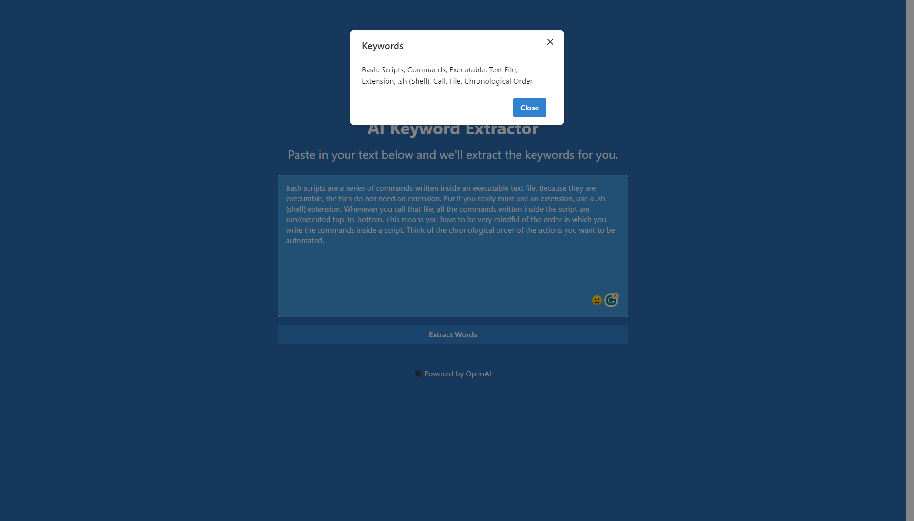

# AI Keyword Extractor

This simple AI keyword extractor parses a text and returns the keywords from that text.

You could use it to generate the tags of a blogpost you've written.

## Technologies
1. React (Vite)
2. Open AI GPT-3 API (Davinci model)
3. Chakra UI

## Author

Project contributed to and maintained by:

- [Bob Oyier](https://github.com/oyieroyier/)

## ISC

### ISC License (ISC)

